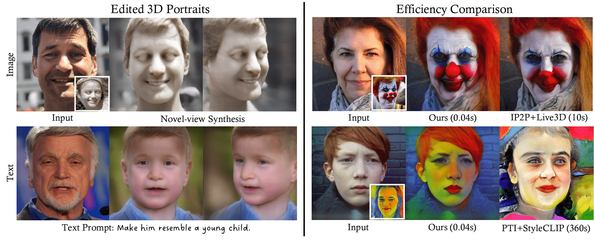
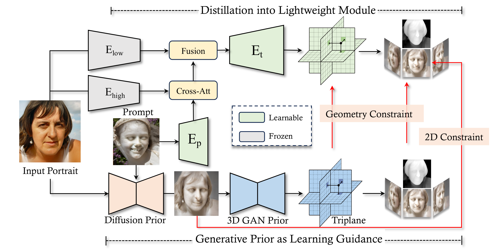

# Real-time 3D-aware Portrait Editing from a Single Image

> **Real-time 3D-aware Portrait Editing from a Single Image** <br>
> Qingyan Bai, Zifan Shi, Yinghao Xu, Hao Ouyang, Qiuyu Wang, Ceyuan Yang, Xuan Wang, Gordon Wetzstein, Yujun Shen, Qifeng Chen <br>
> European Conference on Computer Vision (ECCV) 2024

<div align=center>

</div>

**Figure:**  Editing results produced by our proposed 3DPE, which
allows users to perform 3D-aware portrait editing using image or text prompts.

**[**[**Paper**](https://arxiv.org/pdf/2402.14000)**]**
**[**[**Project Page**](https://ezioby.github.io/3dpe/)**]**

This work presents 3DPE, a practical method that can efficiently edit a face image following given prompts, like reference images or
text descriptions, in a 3D-aware manner. To this end, a lightweight module is distilled from a 3D portrait generator and a text-to-image model,
which provide prior knowledge of face geometry and superior editing capability, respectively. Such a design brings two compelling advantages
over existing approaches. First, our method achieves real-time editing with a feedforward network (i.e., ∼0.04s per image), over 100× faster
than the second competitor. Second, thanks to the powerful priors, our module could focus on the learning of editing-related variations, such
that it manages to handle various types of editing simultaneously in the training phase and further supports fast adaptation to user-specified 
customized types of editing during inference.

<div align=center>

</div>

**Figure:**  Method overview. We distill priors in the 2D diffusion model and
3D GAN for real-time 3D-aware editing.


## BibTeX

If you find our work helpful for your research, please consider to cite:
```bibtex
@inproceedings{bai20243dpe,
  title     = {Real-time 3D-aware Portrait Editing from a Single Image},
  author    = {Bai, Qingyan and Shi, Zifan and Xu, Yinghao and Ouyang, Hao and Wang, Qiuyu and Yang, Ceyuan and Wang, Xuan and Wetzstein, Gordon and Shen, Yujun and Chen, Qifeng},
  booktitle = {European Conference on Computer Vision},
  year      = {2024}
}
```
